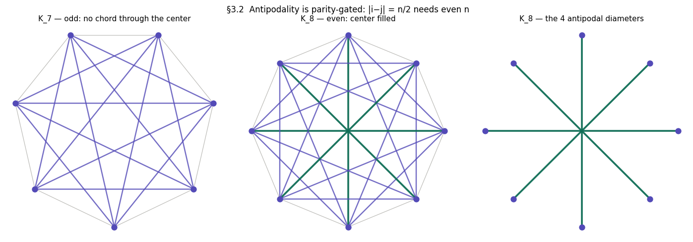
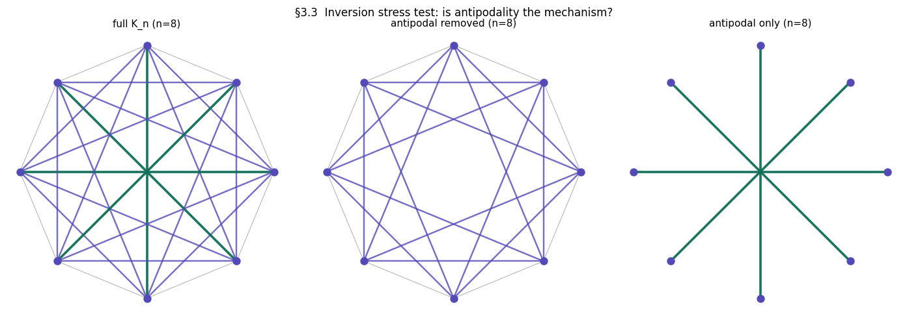
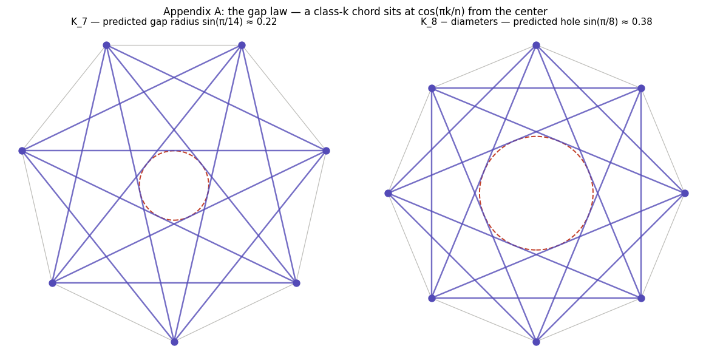
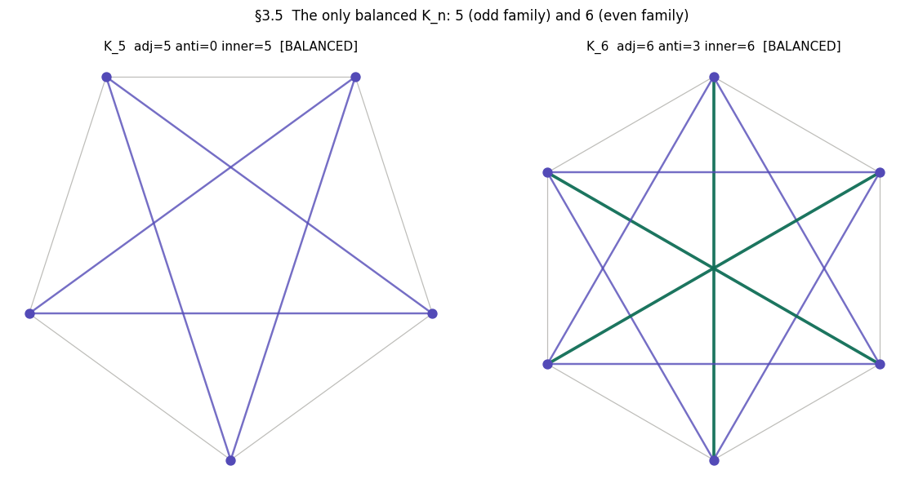
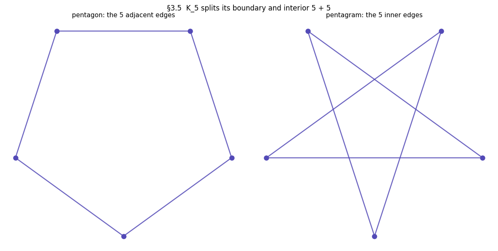
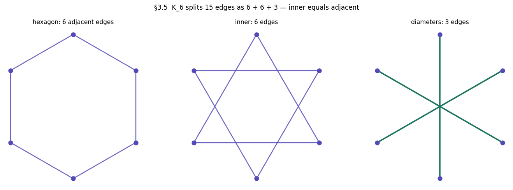
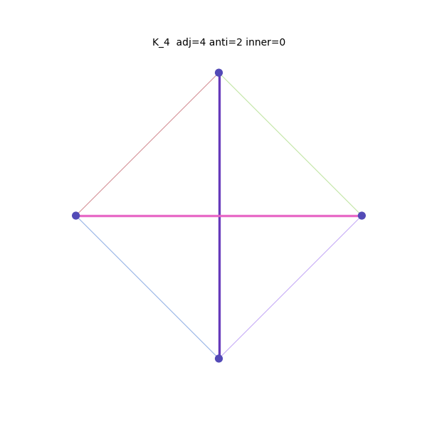

# Demo: the kn-balance argument, figure by figure

This is a guided walkthrough of [the paper](kn_edge_class_balance.md), with each
of its points regenerated by the companion visualizer.

The walkthrough tracks the paper at v0.2, including the quantitative gap-law
addenda. The images below live in `demo/` and are regenerable at any time:

```bash
python demo.py            # rewrites everything referenced here (byte-identical reruns)
python demo.py --tour     # or take the live version: close each window to advance
```

---

## 1. The forced shapes (§2)

The session began with an animation of K_n for rising n and the remark that it
"creates the sacred geometry" — 3 triangle, 4 cross, 5 star. The first real
insight: **the shapes are forced, not designed.** A circle is the only layout
that privileges no point, and full connectivity determines everything else, so
any culture that draws "n equal things, all related" arrives at the same
images. The ubiquity of these symbols is evidence of a shared constraint, not a
shared tradition.


## 2. The parity mechanism (§3.1–3.2)

The opening also carried the session's first error: a claimed "cycles of ten"
pattern in the filled/empty centers. Engaging with the claim — proposing a test
rather than dismissing it — led to the corrected observation: the alternation
tracks **odd/even**. The mechanism is one line: points i and j are antipodal
exactly when |i − j| = n/2, which requires even n. Even n puts n/2 diameters
through the exact center; odd n leaves a visible gap.



## 3. The inversion stress test (§3.3)

Working hypothesis at this point: *antipodality fills the center.* The
inversion operator attacks it directly — remove exactly the antipodal chords
and the center should empty. At n = 8 it largely does: the middle panel below
has a visibly open central hole. The original session read this as "still
partially fills"; the paper's v0.2 addendum shows that reading belongs to the
large-n regime, where the hole shrinks while near-center crossing density
(combinatorial, C(n,4)-driven) climbs. The conclusion survives in either
regime: antipodality is **necessary but not sufficient**, and the "filled
center" is two superposed mechanisms — exact central crossings plus
near-center density. The diameters alone give a sparse star, not a filled
region.



The same three panels morphing over n = 4…9 — in the right panel the diameters
dissolve and reappear as parity flips, the §3.2 gate watched in real time:


**The gap law** (v0.2, Appendix A) makes all of this exact. A chord connecting
points k steps apart sits at distance cos(πk/n) from the center. So the odd-n
central gap has radius sin(π/(2n)), and removing the diameters from even K_n
leaves a hole of radius sin(π/n) — at small n roughly *twice* the gap of the
odd neighbors (K₈ − diameters: 0.38, vs K₇: 0.22 and K₉: 0.17). The dashed
circles below are the formula's predictions; the renderings fill everything
outside them:



## 4. The balance theorem (§3.4–3.5)

Asked to extract more patterns, the AI asserted K₅ was the *unique* point where
inner edge count equals adjacent edge count — and "corrected" the human's
report that K₆ balances too. The human pushed back: *re-check your math.* The
error was **taxonomy decay**: the AI had built the three-class split
(adjacent / antipodal / inner) two turns earlier and failed to apply it. Under
the session's own taxonomy, K₆ = 6 adjacent + 3 antipodal + 6 inner. The human
was right.

```
  n  total  adjacent  antipodal  inner   C(n,4)  balance
--------------------------------------------------------
  3      3         3          0      0        0
  4      6         4          2      0        1
  5     10         5          0      5        5  <== inner = adjacent
  6     15         6          3      6       15  <== inner = adjacent
  7     21         7          0     14       35
  8     28         8          4     16       70
  9     36         9          0     27      126
 10     45        10          5     30      210
 11     55        11          0     44      330
 12     66        12          6     48      495

Theorem scan n=3..10000: balanced at [5, 6]  (PASS — only n=5 (odd), n=6 (even))
```

**The theorem:** for odd n, inner = adjacent means n(n−3)/2 = n, forcing n = 5;
for even n, n(n−4)/2 = n forces n = 6. One linear equation per parity family,
one solution each — K₅ and K₆ are the last balanced graphs of their lines.



What balance means structurally: in K₅ the boundary pentagon and the interior
pentagram carry exactly equal edge weight, 5 and 5. The sensation — reported
across cultures for millennia — that the pentagram is "complete" or "in
equilibrium" has a literal combinatorial referent. (Both panels use identical
styling, because the point is the equality.)



The even balance point has the same structural reading: K₆ splits its 15 edges
as hexagon 6 + inner 6 + diameters 3 — inner equals adjacent here too, with the
three diameters as the parity surplus the odd family never has.



## 5. The Ramsey overclaim and the open questions (§3.6, §5)

Near the session's end, the AI noticed that 5 and 6 also mark the Ramsey
threshold R(3,3) = 6 and declared the balance point "marks exactly this
transition." On an explicitly requested audit, the claim failed: edge-class
balance is a property of a specific geometric drawing, while Ramsey numbers are
layout-independent — no causal mechanism connects them. The claim was demoted
to an open question. The recorded rule: **shared constants are a prompt for
investigation, never a conclusion.**

Open questions (§5): the Ramsey coincidence; perceptual correlates of the K₅
balance point — now sharpened by the gap law into a testable prediction, that
odd/even discrimination should degrade on a 1/n law as the central gap
sin(π/(2n)) falls below visual acuity; analogous taxonomies for other layouts
(sphere, concentric circles); and whether the failure signatures seen here —
momentum errors, taxonomy decay, resolution hunger — recur across sessions.

## 6. Coda: the toolkit (§6)

Every figure above is regenerable from `kn_explorer.py`. The per-edge random
palette below (new palette every run) is the kind of stimulus variation §5's
perception question calls for:



---

## Appendix: the commands behind each figure

| Figure | Equivalent command |
|---|---|
| 1 | `python kn_explorer.py --animate 3 10 --smooth` |
| 2 | `python kn_explorer.py --show 7` / `--show 8` / `--show 8 --mode antionly` |
| 3 | `python kn_explorer.py --inversion 8` |
| 4 | `python kn_explorer.py --animate-inversion 4 9 --smooth` |
| 5 | `--show 7` and `--show 8 --mode noanti` (dashed prediction circles are demo-composed) |
| table | `python kn_explorer.py --stats 3 12` |
| 6 | `python kn_explorer.py --show 5` / `--show 6` |
| 7 | `python kn_explorer.py --show 5 --mode adjonly` / `--mode inneronly` |
| 8 | `python kn_explorer.py --show 6 --mode adjonly` / `--mode inneronly` / `--mode antionly` |
| 9 | `python kn_explorer.py --animate 4 8 --smooth --random-colors --seed 56` |

Add `--save out.gif` to any animation command to export it.
